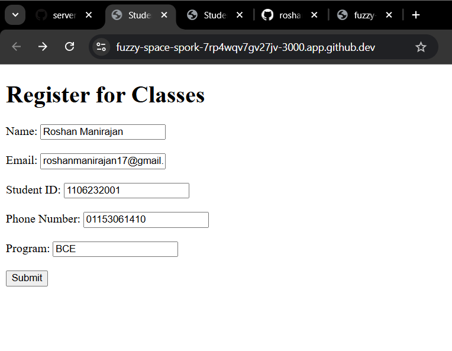
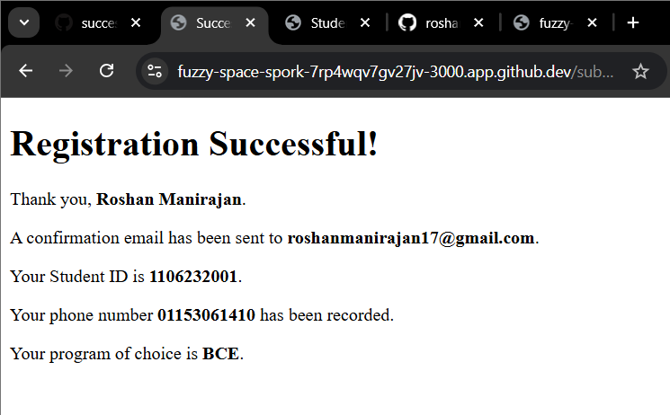

<h2>Roshan Manirajan 1106232001 </h2>

<h1>LAB 1: CLOUD ENVIRONMENT SETUP</h1>

**Personal Feedback: Lab 1 – Cloud Environment Setup**

This lab helped me understand the basics of setting up a cloud environment and using cloud platforms. I learned how to configure services and the importance of following the correct steps to avoid errors.

Some parts were a bit challenging, especially understanding new terms and settings, but I was able to overcome them with practice. Overall, this lab improved my knowledge and gave me useful hands-on experience in cloud computing.

<h3>OUTPUT 1:</h3>

<h3>OUTPUT 2:</h3>

<h3>OUTPUT 3:</h3>

<h3>OUTPUT 4:</h3>

<h1>LAB 2: EJS AND HTML FORM</h1>

**Personal Feedback: Lab 2 –EJS AND HTML FORM**

I learned how to integrate EJS with HTML forms to build dynamic and interactive web applications. I gained a better understanding of how to design forms to collect user input and how that data can be processed and displayed using EJS templates. I also learned how to pass data from the server to the front-end, which made the pages more responsive and personalized.

Additionally, this lab helped me understand the connection between the front-end and back-end, especially how user input flows through the system. Overall, it improved my understanding of creating functional web applications that are both interactive and user-friendly.

<h3>OUTPUT 1:</h3>

<h3>OUTPUT 2:</h3>

