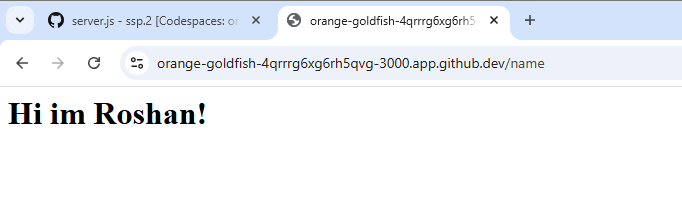
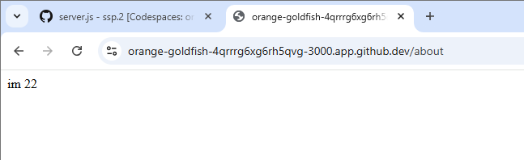
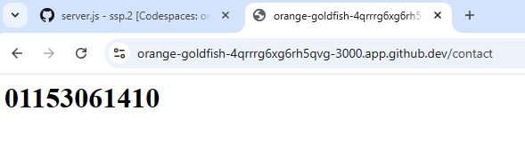
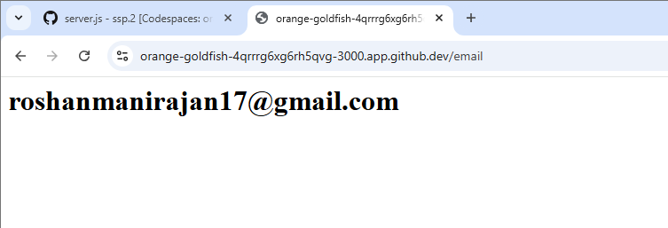

<h1>LAB 1: CLOUD ENVIRONMENT SETUP</h1>

<h2>Roshan Manirajan 1106232001 </h2>

**Personal Feedback: Lab 1 – Cloud Environment Setup**

This lab helped me understand the basics of setting up a cloud environment and using cloud platforms. I learned how to configure services and the importance of following the correct steps to avoid errors.

Some parts were a bit challenging, especially understanding new terms and settings, but I was able to overcome them with practice. Overall, this lab improved my knowledge and gave me useful hands-on experience in cloud computing.

<h3>OUTPUT 1:</h3>

<h3>OUTPUT 2:</h3>

<h3>OUTPUT 3:</h3>

<h3>OUTPUT 4:</h3>

